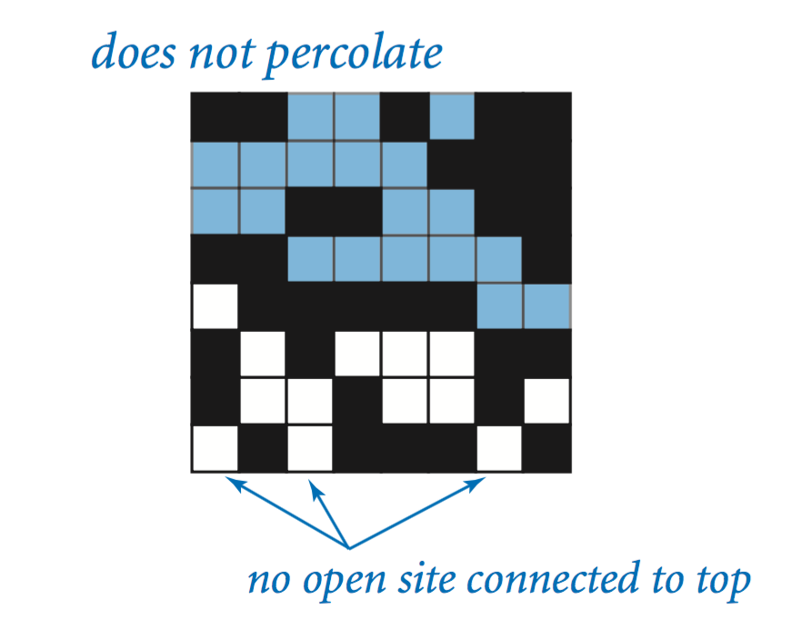
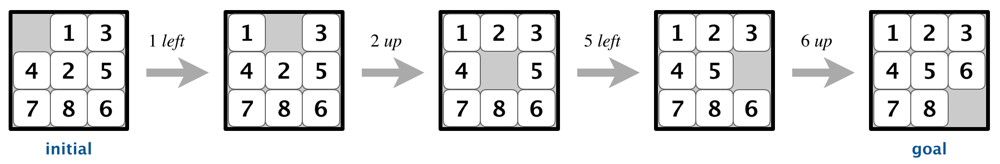

# Assignments from Algorithms1 - Coursera - Robert Sedgewick
# 1 Percolation
Given a composite systems comprised of randomly distributed insulating and metallic materials: what fraction of the materials need to be metallic so that the composite system is an electrical conductor? Given a porous landscape with water on the surface (or oil below), under what conditions will the water be able to drain through to the bottom? Scientists have defined an abstract process known as percolation to model such situations.
 
 
Solution models a percolation system using an n-by-n grid of sites. Each site is either open or blocked. A full site is an open site that can be connected to an open site in the top row via a chain of neighboring (left, right, up, down) open sites. We say the system percolates if there is a full site in the bottom row. In other words, a system percolates if we fill all open sites connected to the top row and that process fills some open site on the bottom row.
See image

      

The solution uses a <code>WeightedUnionFind</code> data type to find out connections between cells and checks if 2 elements in the graph are a part of the same connected components.

# 2 Eight Puzzle

The problem. The 8-puzzle is a sliding puzzle that is played on a 3-by-3 grid with 8 square tiles labeled 1 through 8, plus a blank square. The goal is to rearrange the tiles so that they are in row-major order, using as few moves as possible. You are permitted to slide tiles either horizontally or vertically into the blank square. The following diagram shows a sequence of moves from an initial board (left) to the goal board (right).

The code models the 3x3 board using a 2 dimensional array, and uses Hamming and Manhattan's distance to check how close it is to the final solution, and uses a priority queue to decide what move should be made next.

# Collinear

